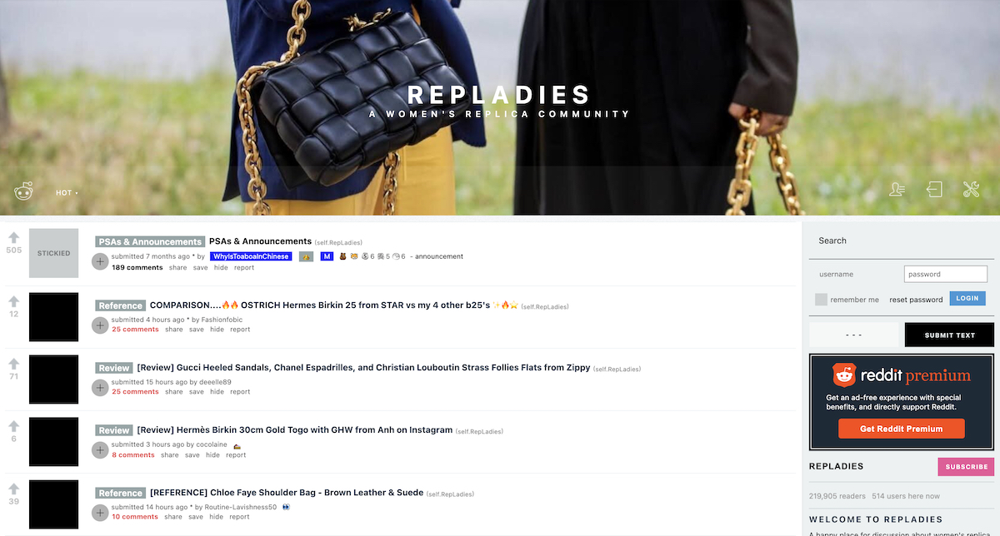

# RepLadies Wiki Archive

Sadly our beloved `r/RepLadies` subreddit has permanently closed to the public and access to the historic wiki has been revoked. There have been numerous discords, WhatsApp and Wechat groups that have splintered off since, but the core info from the wiki is fragmented across these platforms and difficult to follow.

This repo is a _gently modified replica_ of as much of the cached and archived wiki pages that we can find, before they disappear forever.

References to moderators, posting rules and general Reddit-specific things that don't apply here have been removed. Links to inaccessible comments or pages have been redirected to [Wayback Machine](https://web.archive.org) and [Unddit](https://unddit.com) where possible.

---

